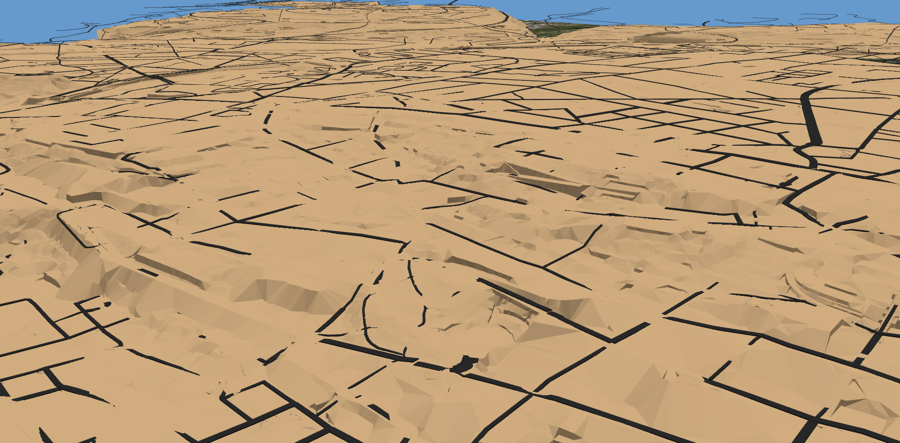

# Roads from 3D relief and bridges

[**Online demo**](https://projet.liris.cnrs.fr/vcity/permalink/demo-ui-data-driven.html)

Update drag-and-dropped files by raycasting on 3DTiles models. The files must be **GeoJson** files containing `LineString` or `MultiLineString` features. The coordinates of those lines will be updated with the altitude (Z coordinate) of the raycast intersection point.  
The raycast only works on visible 3DTiles layers. If you don't want to use relief/bridges to update your altitudes, you can hide the corresponding layer with the `LayerChoice` widget.

Set layers visible/invisible:


Drag and drop:


Roads **before** update:



Roads **after** update:


## Install the application

The application can be locally (on your desktop) started in the following way

```bash
npm install
npm run build
```

## Run the application

Run the application with Python:

```bash
python3 -m hhtp.server
```

and then use your favorite (web) browser to open
`http://localhost:8000/`.

## Docker

A docker version is available [here](https://github.com/VCityTeam/UD-Demo-VCity-UI-driven-data-computation-Lyon-docker).
